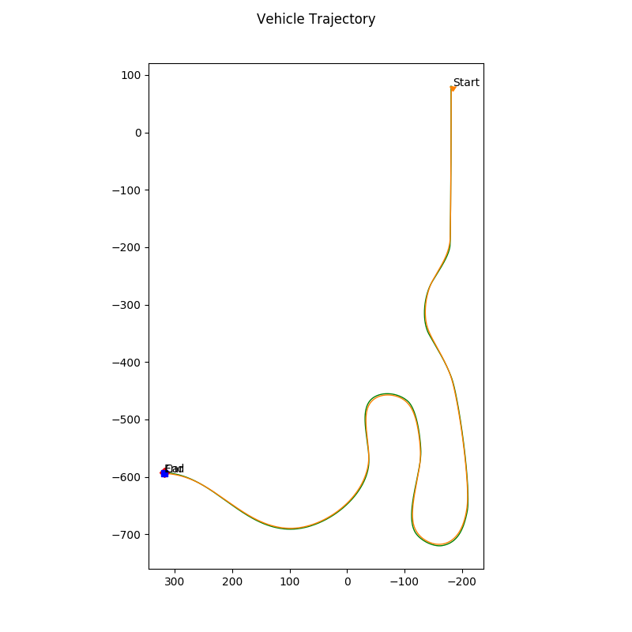
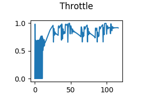
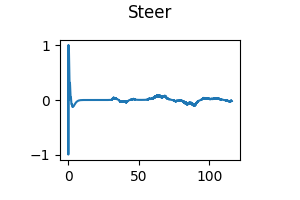
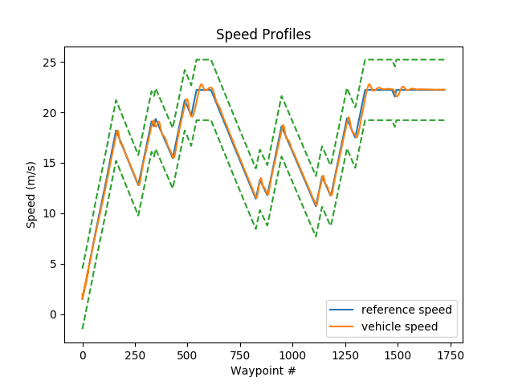

# PID_and_Stanley_for_waypoint_tracking_in_Carla
# Course 1 Final Project | Self-Driving Vehicle Control
  
# Project Overview  
In this project, I wrote and implemented a controller for the CARLA simulator. Our goal was to control the vehicle to follow a race track by navigating through preset waypoints. The vehicle needs to reach these waypoints at certain desired speeds, so both longitudinal and lateral control will be required.  
  
# Project Specifications  
In this project, I implemented a simple controller in Python and used it to drive a car around a track in Carla. The track is a loop shown in this 

. 

I was given a sorted list of waypoints which are equally spaced on this track. The waypoints include their positions as well as the speed the vehicles should attain. As a result, the waypoints become the reference signal for the controller and navigating to all the waypoints effectively completes the full track.  
  
Since the controller reference contains both position and speed, I implemented both:
- longitudinal control - PID controller
- lateral control - Stanley controller
#Requirements:
CARLA 0.9.10
python >= 3.6

Run the following commands by placing the folder inside the PythonClient folder of CARLA

Inside the CARLA Root folder run:

For Windows
- ./CarlaUE4.exe /Game/Maps/RaceTrack -windowed -carla-server -benchmark -fps=30

For Ubuntu
- ./CarlaUE4.sh /Game/Maps/RaceTrack -windowed -carla-server -benchmark -fps=30

Navigate to the PythonClient/Course1FinalProject and run:

For Windows:
- python module_7.py

For Ubuntu:
- python3 module_7.py

throttle output 

streering putput

speed profiles 

. 
